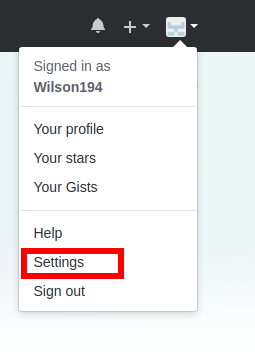

GitHub
=======

This application communicate with GitHub all the time. For this purpose labelord
using GitHub API. When you want to communicate with GitHub API, you must authenticate session.

Secret
---------

GitHub secret is for authenticate communication with GitHub API. This is something like password
so never tell him anyone. You can create new secret at GitHub setting:

Select settings in menu

Select developer option

Click on **Generate new token**

Generate new token

After generate token, save this token! After continue to next step, you will never found
this token again! This token you must fill in to application (config or parameter)

Webhook
---------

GitHub API can create some request to your web after action. This is used for some feedback actions depends
on GitHub actions. You can send this notifications to some web server, and parse this requests. For out project
you could use webhook for replicating labels from one repository to another repositories. We just need to set up
source repository, to send some requests to out server with running labelord application (server part).
You can enable webhook for as many repositories as you want, but all webhooks must have same secret!

You must enable this feature in GitHub setting of repository.
Webhook is not for whole account but only for one repo!

Click on **settings** in repository, where you want to create webhook.

Select option **Webhooks** and in that section click on **Add webhook**

Now you are in form for creating new webhook. There you must fill informations about your server.
First you must specify **Payload URL**. This is url, where all requests will be send. This should be your server
address.

Next there is **Content type** option. There must be specified json format, because our application using only json format.
Next option option is **secret**. This is something like your password. This secret you must fill in config file under option
**webhook_secret** under GitHub section.  Last item is types of events, you could select **send me everything** or just enable
what you want, but you must enable all actions about labels!

Click on **Add webhook** and you are ready for replicating labels from your repository! Hurayyyy!